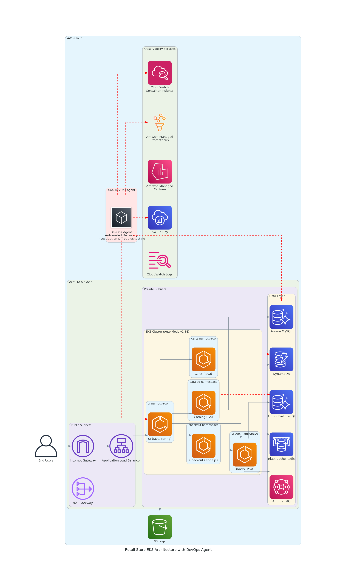

# AWS DevOps Agent Workshop - EKS Sample

> **🚀 Quick Start:** Run `./terraform/deploy.sh` to deploy the complete environment in one command.

---

> **⚠️ Disclaimer:** This repository includes intentional fault injection scenarios designed to demonstrate the AWS DevOps Agent's investigation capabilities. **Do not run these scripts in production environments.**

> **📦 Source Code:** The Retail Store Sample Application source: https://github.com/aws-containers/retail-store-sample-app

---

## Table of Contents

- [Quick Start](#-quick-start)
- [Architecture Overview](#architecture-overview)
- [Manual Deployment](#manual-deployment)
- [AWS DevOps Agent Setup](#aws-devops-agent-setup)
- [Fault Injection Scenarios](#fault-injection-scenarios)
- [Cleanup](#cleanup)

---

## 🚀 Quick Start

### Prerequisites

Install these tools before deploying:

| Tool | Installation |
|------|-------------|
| AWS CLI | [Install Guide](https://aws.amazon.com/cli/) |
| Terraform | [Install Guide](https://developer.hashicorp.com/terraform/downloads) |
| kubectl | [Install Guide](https://kubernetes.io/docs/tasks/tools/) |

Configure AWS credentials:
```bash
aws configure
# Enter your AWS Access Key ID, Secret Access Key, and default region (us-east-1)
```

### One-Click Deployment

```bash
# Clone the repository
git clone https://github.com/aws-samples/sample-devops-agent-eks-workshop.git
cd sample-devops-agent-eks-workshop

# Deploy everything (~25-30 minutes)
./terraform/deploy.sh
```

The script will:
1. ✅ Check prerequisites (Terraform, kubectl, AWS CLI)
2. ✅ Deploy EKS cluster with all dependencies
3. ✅ Configure kubectl access
4. ✅ Wait for application pods to be ready
5. ✅ Display the application URL and next steps

**Customize deployment:**
```bash
# Custom cluster name and region
CLUSTER_NAME=my-cluster AWS_REGION=us-west-2 ./terraform/deploy.sh

# Enable Amazon Managed Grafana (requires AWS SSO)
ENABLE_GRAFANA=true ./terraform/deploy.sh
```

---

## Architecture Overview

The Retail Store Sample App is a microservices e-commerce application demonstrating AWS service integrations:



### Microservices

| Service | Language | Backend | Description |
|---------|----------|---------|-------------|
| UI | Java | - | Store user interface |
| Catalog | Go | Aurora MySQL | Product catalog API |
| Carts | Java | DynamoDB | Shopping carts API |
| Orders | Java | Aurora PostgreSQL + RabbitMQ | Orders API |
| Checkout | Node.js | Redis | Checkout orchestration |

### Infrastructure Components

**Deployed by Terraform:**
- Amazon EKS (v1.34) with EKS Auto Mode
- Amazon VPC with public/private subnets across 3 AZs
- Amazon Aurora MySQL & PostgreSQL
- Amazon DynamoDB
- Amazon MQ (RabbitMQ)
- Amazon ElastiCache (Redis)
- CloudWatch Container Insights with Application Signals
- Amazon Managed Prometheus

**Resource Tagging:**
All resources are tagged with `devopsagent = "true"` for automatic discovery by the AWS DevOps Agent.

---

## Manual Deployment

If you prefer step-by-step deployment instead of the deploy script:

```bash
# Navigate to Terraform directory
cd terraform/eks/default

# Initialize and deploy
terraform init
terraform plan
terraform apply

# Configure kubectl
aws eks update-kubeconfig --name retail-store --region us-east-1

# Verify deployment
kubectl get pods -A | grep -E "carts|catalog|orders|checkout|ui"
```

### Configure EKS Access Entry

After deployment, add your IAM role to the cluster:

```bash
# Get your IAM identity
aws sts get-caller-identity

# Create access entry (replace YOUR_ROLE_ARN)
aws eks create-access-entry \
  --cluster-name retail-store \
  --principal-arn YOUR_ROLE_ARN \
  --type STANDARD

aws eks associate-access-policy \
  --cluster-name retail-store \
  --principal-arn YOUR_ROLE_ARN \
  --policy-arn arn:aws:eks::aws:cluster-access-policy/AmazonEKSClusterAdminPolicy \
  --access-scope type=cluster
```

---

## AWS DevOps Agent Setup

AWS DevOps Agent automatically investigates and diagnoses infrastructure issues. Follow these steps to integrate it with your deployment.

> **Note:** AWS DevOps Agent is in **public preview** and available in **US East (N. Virginia)** (`us-east-1`).

### Step 1: Create an Agent Space

1. Open the [AWS DevOps Agent console](https://console.aws.amazon.com/devops-agent/home?region=us-east-1)
2. Click **Create Agent Space +**
3. Configure:
   - **Name:** `retail-store-eks-workshop`
   - **AWS resource access:** Select **Auto-create a new AWS DevOps Agent role**
4. **Add tag filter** (required for Terraform-deployed resources):
   - Tag Key: `devopsagent`
   - Tag Value: `true`
5. **Enable Web App:** Select **Auto-create a new AWS DevOps Agent role**
6. Click **Submit**

### Step 2: Configure EKS Access

The DevOps Agent needs Kubernetes API access to investigate pod issues.

1. In your Agent Space, go to **Capabilities** → **Cloud** → **Primary Source** → **Edit**
2. Follow the console instructions to grant EKS access

For detailed instructions: [AWS EKS access setup documentation](https://docs.aws.amazon.com/devopsagent/latest/userguide/configuring-capabilities-for-aws-devops-agent-aws-eks-access-setup.html)

### Step 3: Start an Investigation

1. Click **Operator access** to open the Web App
2. Click **Start Investigation**
3. Describe the issue (e.g., "Product pages are loading slowly")
4. Watch the agent analyze logs, metrics, and traces automatically

---

## Fault Injection Scenarios

Test the DevOps Agent's investigation capabilities with these fault injection scripts.

### Setup

```bash
cd fault-injection
chmod +x *.sh
```

### Available Scenarios

| Scenario | Inject | Rollback | Symptom |
|----------|--------|----------|---------|
| **Catalog Latency** | `./inject-catalog-latency.sh` | `./rollback-catalog.sh` | Product pages loading slowly |
| **Network Partition** | `./inject-network-partition.sh` | `./rollback-network-partition.sh` | Website unreachable |
| **RDS Security Group Block** | `./inject-rds-sg-block.sh` | `./rollback-rds-sg-block.sh` | Catalog pod crashing |
| **Cart Memory Leak** | `./inject-cart-memory-leak.sh` | `./rollback-cart-memory-leak.sh` | Intermittent cart failures |
| **DynamoDB Stress** | `./inject-dynamodb-stress.sh` | `./rollback-dynamodb-stress.sh` | Slow cart operations |

### Investigation Prompts

After injecting a fault, use these prompts to start a DevOps Agent investigation:

**Catalog Latency:**
> "The catalog service is experiencing performance issues. Users are complaining about product pages taking excessively long to load. Please analyze the logs for the catalog microservice to provide detailed analysis and identify the root cause of this performance degradation."

**Network Partition:**
> "UI pod unreachable from other pods in cluster. Pod-to-pod communication failing. Use EKS audit logs in CloudWatch for networking/RBAC investigation."

**RDS Security Group Block:**
> "Multiple critical services have failed simultaneously with catalog and orders pods stuck in continuous crash loops. Both services were functioning normally until recently but now cannot complete startup. Investigate the startup failures and database connection errors."

**Cart Memory Leak:**
> "The cart service has become unstable with pods experiencing frequent restarts and intermittent failures, causing customers to lose shopping cart items. Investigate the pod restart patterns, container health, and resource consumption."

**DynamoDB Stress:**
> "The application is experiencing widespread performance degradation with cart operations becoming significantly slower than normal. Users are reporting that adding items to cart now takes several seconds. Investigate the performance bottlenecks affecting cart functionality."

### Demo Workflow

1. **Verify baseline:** `kubectl get pods -A | grep -E "carts|catalog|orders|checkout|ui"`
2. **Inject fault:** Run the inject script
3. **Observe symptoms:** Check application behavior
4. **Investigate:** Start a DevOps Agent investigation
5. **Rollback:** Run the rollback script
6. **Verify recovery:** Confirm pods return to healthy state

---

## Cleanup

### Quick Cleanup (Recommended)

```bash
./terraform/destroy.sh
```

The script handles:
- AWS auto-provisioned resources (GuardDuty VPC endpoints, security groups)
- Terraform-managed resources
- CloudWatch log groups

### Manual Cleanup

```bash
cd terraform/eks/default
terraform destroy
```

---

## Additional Resources

| Resource | Link |
|----------|------|
| AWS DevOps Agent Documentation | [User Guide](https://docs.aws.amazon.com/devopsagent/latest/userguide/) |
| AWS DevOps Agent Console | [Console](https://console.aws.amazon.com/devops-agent/home?region=us-east-1) |
| Retail Store Sample App | [GitHub](https://github.com/aws-containers/retail-store-sample-app) |

---

## License

This project is licensed under the MIT-0 License. See the [LICENSE](LICENSE) file.
